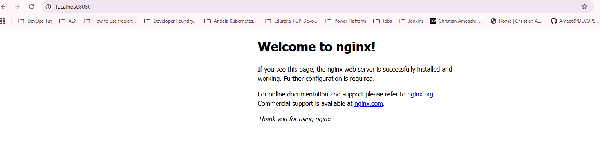
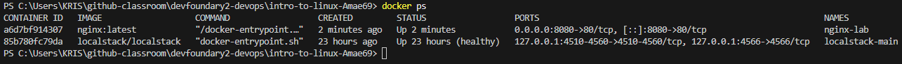

## **Assignment**
- Write a one-page reflection: **“Why is DevOps necessary?”** with examples. 

- Screenshot proof: Nginx container running locally.

### **Task Done :**
---
- I have Install Docker & LocalStack

  See screenshot of of local stack :

  

  run: `docker ps`

  

- **Run nginx container**  

Run `docker run --name nginx-lab -p 8080:80 -d nginx:latest`

