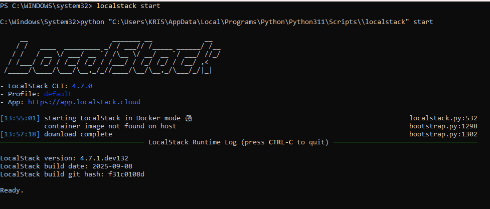
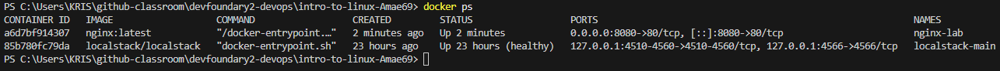

## **Assignment**
- Write a one-page reflection: **“Why is DevOps necessary?”** with examples. 

- Screenshot proof: Nginx container running locally.

### **Task Done :**
---
- I have Install Docker & LocalStack

  See screenshot of of local stack :

  

- **Run nginx container**  

  Run: `docker run --name nginx-lab -p 8080:80 -d nginx:latest`

  

- **Confirm my nginx container is running on port 8080**

  Run: `docker ps`

  

- Confirm on my browser that **nginx** container is running
 on my browser i paste http://localhost:8080

 

### **A one-page reflection of Why is DevOps is necessary with examples**
---
DevOps is necessary because it bridges the gap between the software development team and the operations team. making software deployment faster to the end users and free from human error. 

Traditionally, developers focused on building software application while operations managed stability of this applications. This often leed to miscommunications, delays, of software releases. DevOps integrates these teams through automation, shared responsibility, and continuous feedback, enabling organizations to deliver reliable software faster to the market.

An example why Devops is necessary are: DevOps using Automations like CI/CD pipelines move code from development to production with minimal manual steps, which ensures consistent environments across development, staging, and production, while simplifying rollbacks when releases fail.

DevOps also strengthens reliability and observability. The use of Infrastructure as code and automated configuration allow reproducible environments with consistent monitoring and alerting.

Another key example while devops is necesary is that, DevOps promotes cross-functional teams where developers, QA, and operations share responsibility from design to production.

Ultimately, DevOps is both a cultural and technical approach that improves speed, quality, and reliable software applications.

### **END OF ASSIGNMENT**

