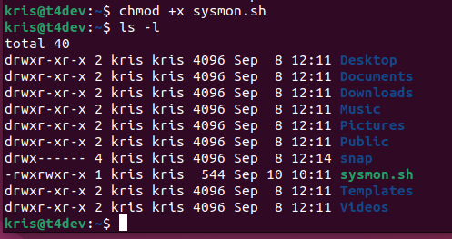

### **ASSIGNMENT**
---
- Update the system monitoring shell script to use well defined  commands specific to the metric we are monitoring

- Set your shell script to run in the background every 5 minutes

- Attach a download of your log file to your submission

- Attach a screenshot of your running processes showing the sysmon.

All changes should be submitted in the main branch of your assignment repo. Once you commit your code, the assignment would be considered submitted.

```
#!/bin/env bash

while true; do
  echo "--- $(date) ---" >> /var/log/sysmon.log
  echo "CPU: $(uptime)" >> /var/log/sysmon.log
  echo "MEMORY:" >> /var/log/sysmon.log
  free -h >> /var/log/sysmon.log
  echo "DISK:" >> /var/log/sysmon.log
  df -h / >> /var/log/sysmon.log
  echo "NET:" >> /var/log/sysmon.log
  ip link | grep eth0 >> /var/log/sysmon.log
  sleep 10
done
```

### **Task Done**
---
- On my Ubuntu VM user home directory, Using vi editor, i create the file named **"sysmon.sh"** and paste my updated Shell script in the file

  Run: `vi sysmon.sh` and paste the shell script below: 

```
#!/bin/env bash

logfile="/var/log/sysmon.log"

NET_IF=$(ip -o link show | awk -F': ' '!/lo/ {print $2; exit}')

while true; do
  echo "--- $(date) ---" >> $logfile

  echo "CPU:" >> $logfile
  mpstat 1 1 | awk '/Average:/ {print "User:", $3"%  System:", $5"%  Idle:", $12"%"}' >> $logfile

  echo "MEMORY:" >> $logfile
  free -h >> $logfile

  echo "DISK:" >> $logfile
  df -h / >> $logfile

  echo "NET ($NET_IF):" >> $logfile
  grep $NET_IF /proc/net/dev >> $logfile

  echo "" >> $logfile
  sleep 300   # 300 seconds = 5 minutes
done
```

- I make the script file executable

  Run: `chmod +x sysmon.sh`

  

- Run the script : `sudo ./sysmon.sh &`

- Run  `ps aux | grep sysmon` to view the running process

- Run `tail -f /var/log/sysmon.log` to view log output


- Run `kill -9 6211` to kill the process


Check **README.MD** file for detail output of the shellm script

### END Of Assignment
